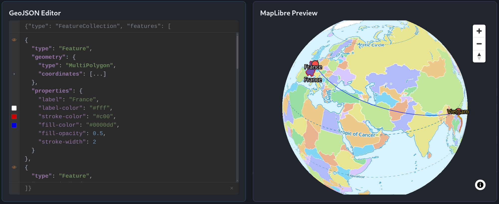

<p align="center">
  <a href="https://www.softwarity.io/">
    
  </a>
</p>

# @softwarity/geojson-editor

<p align="center">
  <a href="https://www.npmjs.com/package/@softwarity/geojson-editor">
    
  </a>
  <a href="https://bundlephobia.com/package/@softwarity/geojson-editor">
    
  </a>
  <a href="https://github.com/softwarity/geojson-editor/blob/main/LICENSE">
    
  </a>
  <a href="https://codecov.io/gh/softwarity/geojson-editor">
    
  </a>
</p>

A feature-rich, framework-agnostic **Web Component** for editing GeoJSON features with syntax highlighting, collapsible nodes, and integrated color picker.

**[🚀 Try the Live Demo](https://softwarity.github.io/geojson-editor/)**

<p align="center">
  <a href="https://softwarity.github.io/geojson-editor/">
    
  </a>
</p>

## Why not Monaco, CodeMirror, or Prism?

| | @softwarity/geojson-editor | Monaco Editor | CodeMirror 6 | Prism.js |
|---|:---:|:---:|:---:|:---:|
| **Size (gzip)** |  | ~2.5 MB* | ~150 KB* | ~20 KB* |
| **GeoJSON validation** | ✅ Built-in | ❌ Manual | ❌ Manual | ❌ None |
| **Type highlighting** | ✅ Contextual | ⚠️ Generic JSON | ⚠️ Generic JSON | ⚠️ Generic JSON |
| **Invalid type detection** | ✅ Visual feedback | ❌ | ❌ | ❌ |
| **Collapsible nodes** | ✅ Native | ✅ | ✅ Plugin | ❌ |
| **Undo/Redo** | ✅ With grouping | ✅ | ✅ | ❌ |
| **Color picker** | ✅ Integrated | ❌ | ❌ | ❌ |
| **Boolean checkbox** | ✅ Integrated | ❌ | ❌ | ❌ |
| **Feature visibility toggle** | ✅ | ❌ | ❌ | ❌ |
| **Auto-collapse coordinates** | ✅ | ❌ | ❌ | ❌ |
| **FeatureCollection output** | ✅ Always | ❌ | ❌ | ❌ |
| **Clear button** | ✅ | ❌ | ❌ | ❌ |
| **Save to file (Ctrl+S)** | ✅ | ❌ | ❌ | ❌ |
| **Open from file (Ctrl+O)** | ✅ | ❌ | ❌ | ❌ |
| **Dark mode detection** | ✅ Auto | ⚠️ Manual | ⚠️ Manual | ⚠️ Manual |
| **Dependencies** | 0 | Many | Few | 0 |
| **Setup complexity** | 1 line | Complex | Moderate | Simple |

<sub>* Estimated total size: Monaco includes web workers loaded dynamically; CodeMirror/Prism require plugins for equivalent functionality (line numbers, folding, language support).</sub>

**TL;DR**: If you're building a GeoJSON-focused application and need a lightweight, specialized editor with built-in validation and GeoJSON-aware features, this component does exactly that — without the overhead of a general-purpose code editor.

## Features

- **GeoJSON-Aware Highlighting** - Distinct colors for GeoJSON keywords (`type`, `coordinates`, `geometry`, etc.)
- **GeoJSON Type Validation** - Valid types (`Point`, `LineString`, `Polygon`, etc.) highlighted distinctly; invalid types (`LinearRing`, unknown types) shown with error styling (colors configurable via theme)
- **Syntax Highlighting** - JSON syntax highlighting with customizable color schemes
- **Collapsible Nodes** - Collapse/expand JSON objects and arrays with visual indicators (`{...}` / `[...]`); use Tab to expand and Shift+Tab to collapse; `coordinates` auto-collapsed on load
- **Virtualized Rendering** - Monaco-like architecture: only visible lines are rendered to DOM for optimal performance with large GeoJSON files
- **Feature Visibility Toggle** - Hide/show individual Features via eye icon in gutter; hidden features are grayed out and excluded from `change` events (useful for temporary filtering without deleting data)
- **Color Picker** - Built-in color swatch for hex color properties (`#rrggbb`) displayed inline next to the value; click to open native color picker
- **Boolean Checkbox** - Inline checkbox for boolean properties displayed next to the value; toggle to switch between `true`/`false` and emit changes (e.g., `marker: true` to show vertices)
- **Default Properties** - Auto-inject default visualization properties (fill-color, stroke-color, etc.) into features based on configurable rules
- **Dark/Light Themes** - Automatic theme detection from parent page (Bootstrap, Tailwind, custom)
- **Auto-format** - Automatic JSON formatting in real-time (always enabled)
- **Readonly Mode** - Visual indicator with diagonal stripes when editing is disabled
- **Block Editing in Collapsed Areas** - Prevents accidental edits in collapsed sections
- **Smart Copy/Paste** - Copy includes expanded content even from collapsed nodes
- **FeatureCollection Output** - Emits valid FeatureCollection with all edited features
- **Clear Button** - Discreet ✕ button in suffix area to clear all editor content (hidden in readonly mode)
- **Undo/Redo** - Full undo/redo support with Ctrl+Z / Ctrl+Y / Ctrl+Shift+Z; rapid keystrokes grouped as single undo step
- **Save to File** - Ctrl+S to download GeoJSON as `.geojson` file; programmatic `save(filename)` method available
- **Open from File** - Ctrl+O to open a `.geojson` or `.json` file from the client filesystem; programmatic `open()` method available

## Installation

### Option 1: CDN (No build step required)

Simply add a script tag to your HTML file:

```html
<!-- Using unpkg -->
<script type="module" src="https://unpkg.com/@softwarity/geojson-editor"></script>

<!-- Or using jsDelivr -->
<script type="module" src="https://cdn.jsdelivr.net/npm/@softwarity/geojson-editor"></script>
```

You can also specify a version:

```html
<!-- Specific version -->
<script type="module" src="https://unpkg.com/@softwarity/geojson-editor@1.0.0"></script>

<!-- Latest minor/patch of v1 -->
<script type="module" src="https://unpkg.com/@softwarity/geojson-editor@1"></script>
```

### Option 2: NPM (With bundler)

If you're using a bundler (Vite, Webpack, Rollup, etc.):

```bash
npm install @softwarity/geojson-editor
```

Then import in your JavaScript:

```javascript
import '@softwarity/geojson-editor';
```

## Usage

### Basic Usage

```html
<!DOCTYPE html>
<html lang="en">
<head>
  <script type="module" src="https://unpkg.com/@softwarity/geojson-editor"></script>
</head>
<body>
  <!-- User edits features, component wraps in FeatureCollection -->
  <geojson-editor placeholder="Enter GeoJSON features here..."></geojson-editor>
</body>
</html>
```

Users edit features directly (comma-separated), and the component automatically wraps them in a `{"type": "FeatureCollection", "features": [...]}` structure for validation and events.

### With Theme Detection

```html
<geojson-editor dark-selector="html.dark"></geojson-editor>
```

### Listen to Changes

```javascript
const editor = document.querySelector('geojson-editor');

// Valid GeoJSON emits change event with parsed object directly
editor.addEventListener('change', (e) => {
  console.log('GeoJSON:', e.detail); // Parsed GeoJSON object
});

// Invalid JSON or GeoJSON validation error emits error event
editor.addEventListener('error', (e) => {
  console.error('Error:', e.detail.error);
  console.log('Errors:', e.detail.errors); // Array of validation errors (if GeoJSON validation)
});
```

## Attributes

| Attribute | Type | Default | Description |
|-----------|------|---------|-------------|
| `value` | `string` | `""` | Initial editor content (features array content) |
| `placeholder` | `string` | `""` | Placeholder text |
| `readonly` | `boolean` | `false` | Make editor read-only |
| `dark-selector` | `string` | `".dark"` | CSS selector for dark theme (if matches → dark, else → light) |

**Note:** `coordinates` nodes are automatically collapsed when content is loaded to improve readability. Use Tab to expand and Shift+Tab to collapse nodes, or click the gutter toggle.

### Dark Selector Syntax

The `dark-selector` attribute determines when the dark theme is active. If the selector matches, dark theme is applied; otherwise, light theme is used.

**Examples:**

- `.dark` - Component has `dark` class: `<geojson-editor class="dark">`
- `html.dark` - HTML element has `dark` class (Tailwind CSS): `<html class="dark">`
- `html[data-bs-theme=dark]` - HTML has Bootstrap theme attribute: `<html data-bs-theme="dark">`
- Empty string `""` - Uses component's `data-color-scheme` attribute as fallback

## API Methods

```javascript
const editor = document.querySelector('geojson-editor');
```

### Features API

Programmatic manipulation of features:

| Method | Description |
|--------|-------------|
| `set(input)` | Replace all features (throws if invalid) |
| `add(input)` | Add features at the end (throws if invalid) |
| `insertAt(input, index)` | Insert at index (negative = from end: -1 = before last) (throws if invalid) |
| `removeAt(index)` | Remove feature at index (negative = from end), returns removed feature |
| `removeAll()` | Remove all features, returns array of removed features |
| `get(index)` | Get feature at index (negative = from end) |
| `getAll()` | Get all features as an array |
| `emit()` | Emit the current document on the change event |

**Flexible Input:** `set()`, `add()`, and `insertAt()` accept multiple input formats:
- **FeatureCollection** → extracts the `features` array
- **Feature[]** → uses the array directly
- **Feature** → wraps in an array

**Validation:** All input features are validated before adding. Invalid features throw an `Error` with a descriptive message. A valid Feature must have:
- `type: "Feature"`
- `geometry`: object with valid type (`Point`, `LineString`, `Polygon`, etc.) and `coordinates`, or `null`
- `properties`: object or `null`

**Smart Paste:** When pasting GeoJSON content (Ctrl+V), the editor automatically detects and normalizes the format (FeatureCollection, Feature[], or single Feature). Invalid GeoJSON falls back to raw text insertion.

```javascript
// Set features from array
editor.set([
  { type: 'Feature', geometry: { type: 'Point', coordinates: [0, 0] }, properties: {} },
  { type: 'Feature', geometry: { type: 'Point', coordinates: [1, 1] }, properties: {} }
]);

// Set from FeatureCollection
editor.set({
  type: 'FeatureCollection',
  features: [{ type: 'Feature', geometry: { type: 'Point', coordinates: [0, 0] }, properties: {} }]
});

// Set a single feature
editor.set({ type: 'Feature', geometry: { type: 'Point', coordinates: [2, 2] }, properties: {} });

// Add multiple features at once
editor.add([feature1, feature2]);

// Insert FeatureCollection at position 1
editor.insertAt(featureCollection, 1);

// Remove last feature
const removed = editor.removeAt(-1);

// Get all features
const features = editor.getAll();

// Manually emit change event
editor.emit();
```

### Theme API

```javascript
// Get current theme
const themes = editor.getTheme();

// Set custom theme (partial update)
editor.setTheme({
  dark: { background: '#000', textColor: '#fff' },
  light: { background: '#fff', textColor: '#000' }
});

// Reset to defaults
editor.resetTheme();
```

### Undo/Redo API

Full undo/redo support with action grouping:

| Method | Description |
|--------|-------------|
| `undo()` | Undo last action, returns `true` if successful |
| `redo()` | Redo previously undone action, returns `true` if successful |
| `canUndo()` | Check if undo is available |
| `canRedo()` | Check if redo is available |
| `clearHistory()` | Clear undo/redo history |

**Keyboard shortcuts:**
- `Ctrl+Z` / `Cmd+Z` - Undo
- `Ctrl+Y` / `Cmd+Y` - Redo
- `Ctrl+Shift+Z` / `Cmd+Shift+Z` - Redo (alternative)

**Action grouping:** Rapid keystrokes (< 500ms apart, same action type) are automatically grouped as a single undo step. This means typing "hello" quickly creates one undo entry, not five.

```javascript
// Programmatic undo/redo
if (editor.canUndo()) {
  editor.undo();
}

// Clear history after saving
editor.clearHistory();
```

### Save API

Save the current GeoJSON content to a file:

| Method | Description |
|--------|-------------|
| `save(filename?)` | Download GeoJSON as file, returns `true` if successful |

**Keyboard shortcut:**
- `Ctrl+S` / `Cmd+S` - Save with default filename (`features.geojson`)

```javascript
// Save with default filename
editor.save();  // Downloads "features.geojson"

// Save with custom filename
editor.save('my-map-data.geojson');
```

### Open API

Open a GeoJSON file from the client filesystem:

| Method | Description |
|--------|-------------|
| `open()` | Open file dialog, returns `Promise<boolean>` (true if loaded successfully) |

**Keyboard shortcut:**
- `Ctrl+O` / `Cmd+O` - Open file dialog

**Supported formats:**
- FeatureCollection (extracts features array)
- Single Feature (wraps in array)
- Array of Features

**Note:** The `Ctrl+O` shortcut is disabled in readonly mode, but `open()` remains available via API for programmatic loading.

```javascript
// Open file dialog
const success = await editor.open();
if (success) {
  console.log('File loaded:', editor.getAll());
}
```

## Keyboard Shortcuts

| Shortcut | Action |
|----------|--------|
| `Ctrl+S` / `Cmd+S` | Save to file |
| `Ctrl+O` / `Cmd+O` | Open file (disabled in readonly) |
| `Ctrl+Z` / `Cmd+Z` | Undo |
| `Ctrl+Y` / `Cmd+Y` | Redo |
| `Ctrl+Shift+Z` / `Cmd+Shift+Z` | Redo (alternative) |
| `Ctrl+A` / `Cmd+A` | Select all |
| `Ctrl+C` / `Cmd+C` | Copy |
| `Ctrl+X` / `Cmd+X` | Cut |
| `Ctrl+V` / `Cmd+V` | Paste |
| `Tab` | Expand collapsed node at cursor |
| `Shift+Tab` | Collapse innermost node containing cursor |

## Events

### `change`

Fired when content changes and GeoJSON is valid (debounced 150ms).

```javascript
editor.addEventListener('change', (e) => {
  console.log(e.detail);  // Parsed GeoJSON object directly
});
```

**Event detail:** The parsed GeoJSON object (always a FeatureCollection).

**Note:** Hidden features (toggled via the eye icon) are automatically excluded from the emitted GeoJSON. This allows temporary filtering without modifying the actual JSON content.

**Example:**

```javascript
// User edits features only, but change event includes the FeatureCollection wrapper
editor.addEventListener('change', (e) => {
  console.log(e.detail);
  // → { type: "FeatureCollection", features: [{ type: "Feature", ... }] }
});
```

### `error`

Fired when content changes but JSON is invalid or GeoJSON validation fails (debounced 150ms).

```javascript
editor.addEventListener('error', (e) => {
  console.error(e.detail.error);   // Error message
  console.log(e.detail.errors);    // Array of validation errors (GeoJSON validation only)
  console.log(e.detail.content);   // Raw content for debugging
});
```

**Event detail properties:**

| Property | Type | Description |
|----------|------|-------------|
| `error` | `string` | Error message (JSON parse error or GeoJSON validation summary) |
| `errors` | `string[]` | Array of validation errors with paths (GeoJSON validation only) |
| `content` | `string` | Raw editor content (for debugging) |

**GeoJSON validation errors include:**
- Invalid types (e.g., `"LinearRing"`)
- Unknown types (any `type` value not in the GeoJSON specification)

## Styling

The component uses Shadow DOM with CSS variables for theming. Themes can be customized via the `setTheme()` API.

## Browser Support

Works in all modern browsers supporting:
- Web Components
- Shadow DOM
- ES6 Modules

## Development

See [DEVELOPMENT.md](DEVELOPMENT.md) for detailed development guide.

```bash
# Install dependencies
npm install

# Start dev server with live demo
npm run dev

# Build for production
npm run build
```

## License

MIT
